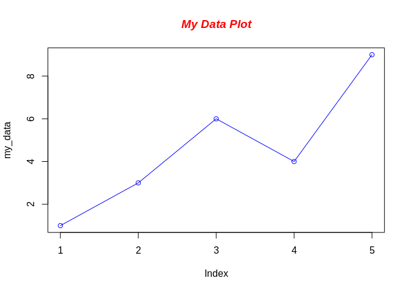

We can put R chunks directly into the `.Rmd` files and the output will
be rendered onto the webpage automatically.

# Hello Rmd

``` r
print("Hello Rmd World!")
```

    ## [1] "Hello Rmd World!"

``` r
x = 1 + 1
print(x)
```

    ## [1] 2

# Example R plot:

``` r
# Define a made-up data vector with 5 values
my_data <- c(1, 3, 6, 4, 9)

# Graph cars using blue points overlayed by a line
plot(my_data, type="o", col="blue")

# Create a title with a red, bold/italic font
title(main="My Data Plot", col.main="red", font.main=4)
```

<!-- -->
